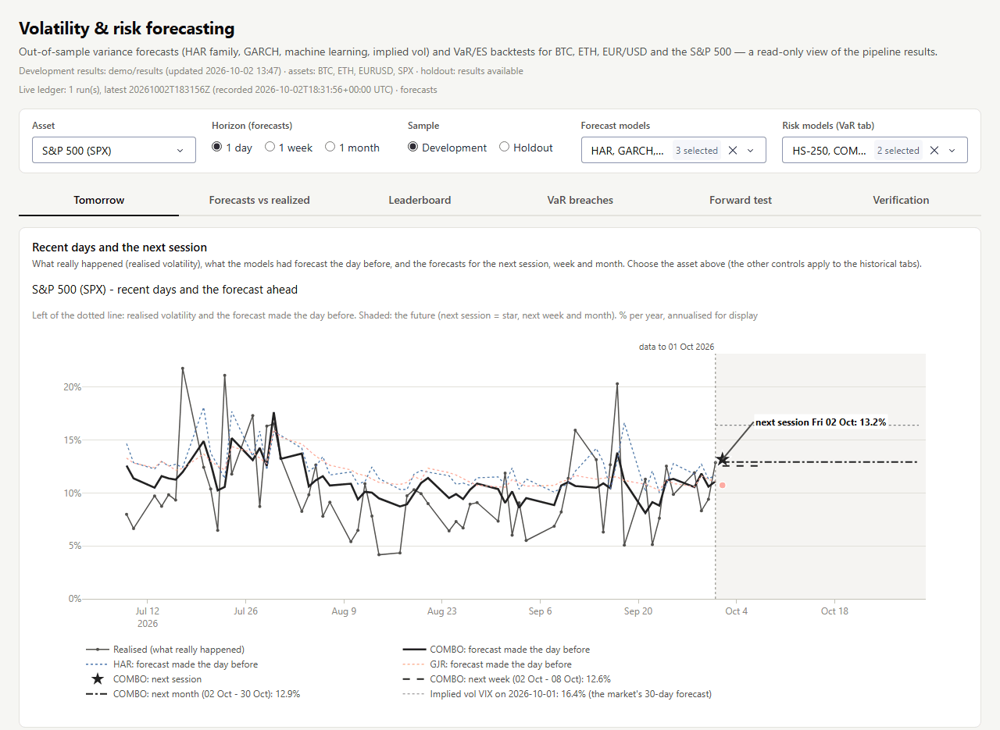
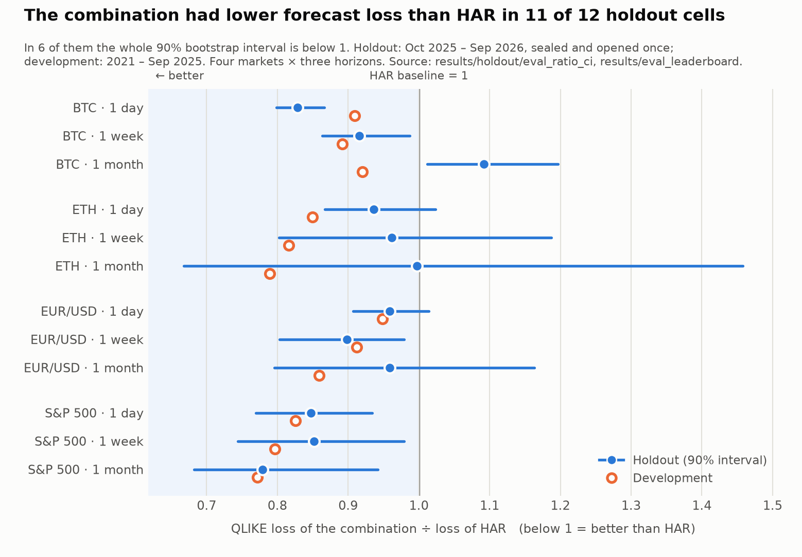
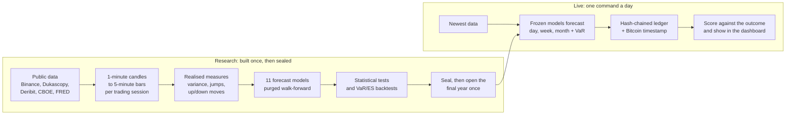
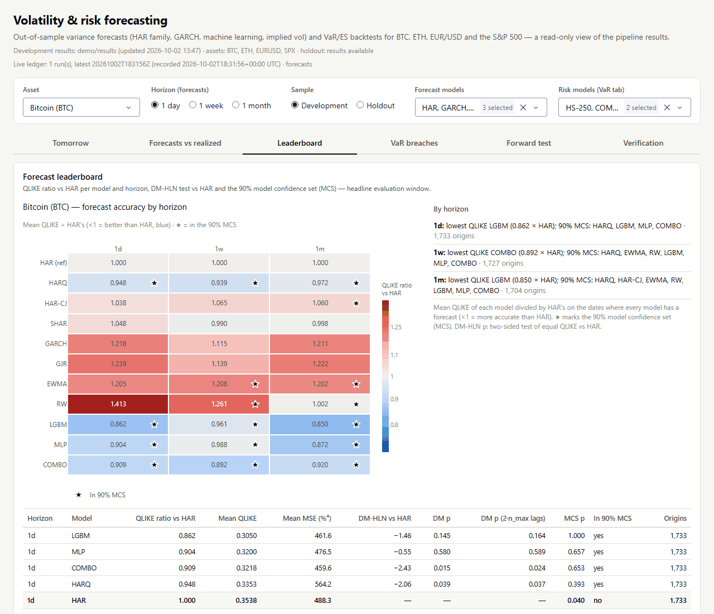
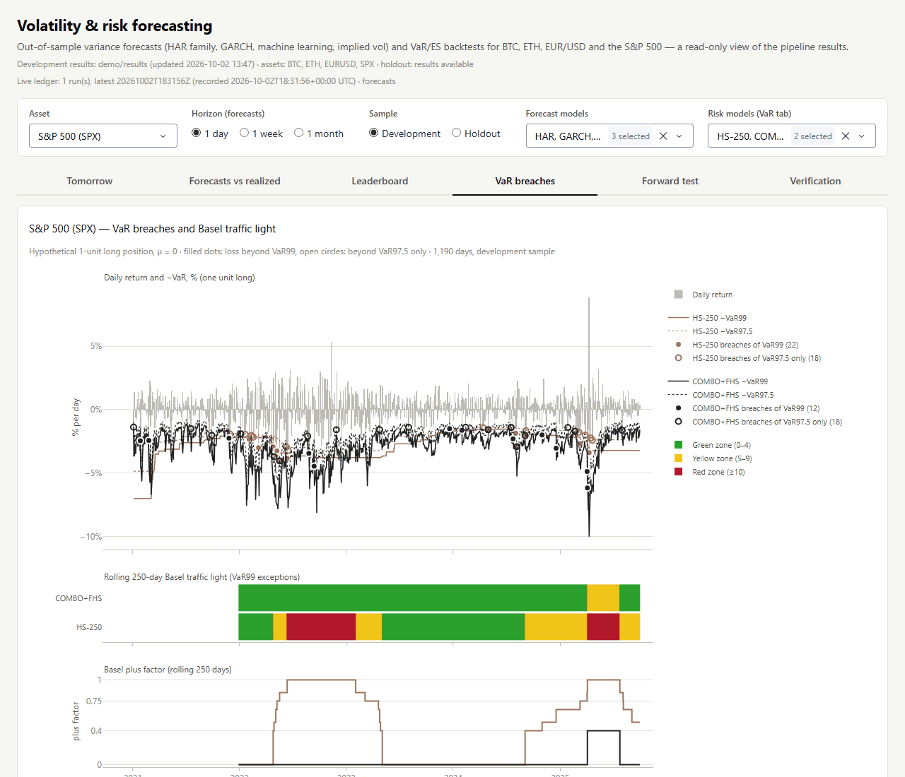

# Volatility & Risk Forecasting: how much will BTC, ETH, EUR/USD and the S&P 500 move?

Banks and traders size positions by how much a market can move. This project tests whether intraday data and
machine learning forecast that better than the standard models.

**It forecasts next-day, next-week and next-month volatility for four markets and turns it into a bank-style risk
limit. On a sealed final year, the model combination beat the standard HAR model in 11 of 12 tests, by up to 22%.**

HAR is the standard academic volatility model: a regression on yesterday's, last week's and last month's
volatility. Forecast error is scored with QLIKE, the usual loss for volatility; a ratio below 1 beats HAR.
Value-at-Risk (VaR) is the daily loss that should be exceeded only 1 day in 100.

The live dashboard's <i>Tomorrow</i> tab: what happened, what the models forecast the day before, and their
forecasts for the next session, week and month. Open it with <code>uv run python -m volrisk_live.dashboard</code>.

## Highlights

- **11 of 12 holdout tests won against HAR, by up to 22%,** for an equal-weight combination of GJR-GARCH, HARQ and
  LightGBM. Measured with QLIKE on 4 markets × 3 horizons over one sealed year.
- **0.58 × HAR's next-day error on BTC** for LightGBM trained directly on QLIKE (90% interval 0.51–0.66, 365 days).
  One month ahead it is no better than HAR.
- **28 and 31 VaR breaches where 12.7 were expected:** RiskMetrics, the textbook bank model, failed on BTC and ETH
  in 2022–2025 (Basel red zone). Filtered historical simulation on the combination had 6 and 13.
- **268,522 of 268,522 earlier forecasts unchanged** when 12 months of future data were added. A leakage test also
  caught 12 of 12 deliberately cheating model runs.
- **20 of 24 verification checks pass, 1 fails, 3 are skipped.** The failure is our own first live run: it started
  too late in the day for its Bitcoin timestamp to predate two sessions' close.

## Results

<picture>
  <source media="(prefers-color-scheme: dark)" srcset="docs/img/results-dark.png">
  
</picture>

Next-day forecasts on the holdout year (Oct 2025 – Sep 2026), QLIKE loss relative to HAR (below 1 = better; bold =
best of the models shown):

| Model | BTC | ETH | EUR/USD | S&P 500 |
| --- | ---: | ---: | ---: | ---: |
| Random walk (naive baseline) | 1.561 | 1.519 | 1.303 | 1.649 |
| HAR (benchmark) | 1.000 | 1.000 | 1.000 | 1.000 |
| HARQ (HAR with a noise correction) | 0.950 | 0.922 | **0.926** | 1.082 |
| GARCH(1,1) | 1.187 | 1.595 | 1.071 | 1.170 |
| GJR-GARCH | 1.107 | 1.382 | 1.108 | 0.958 |
| LightGBM | **0.578** | **0.707** | 1.097 | 1.041 |
| Small neural net (MLP) | 0.688 | 0.712 | 0.976 | 0.970 |
| Combination (GJR + HARQ + LightGBM) | 0.828 | 0.937 | 0.959 | **0.847** |

The combination gives the largest gains, up to 22% below HAR across all horizons. HARQ also beats HAR in 11 of 12
cells, by up to 8%. LightGBM wins clearly on crypto but not on EUR/USD or the S&P 500. At one day, GARCH trails HAR
everywhere except GJR on the S&P 500. Caveat: one year has little statistical power (251–365 days per market), and
the 1-month holdout results are descriptive only.

## How it works

1. **Measure:** 1-minute prices become 5-minute returns per trading session. The target is each day's total
   variance, including the overnight gap.
2. **Forecast:** 11 models, from a random walk to GARCH, HAR, LightGBM and a neural net. Each re-fits on its last
   1,000 observations and never sees later data.
3. **Judge:** QLIKE loss and statistical tests rank the forecasts against HAR and the options market (VIX, DVOL).
   One-day forecasts become VaR and Expected Shortfall, backtested like a bank's.
4. **Prove:** code, data and results were hash-sealed before the final year was opened once. Since 2 Oct 2026 the
   frozen models forecast into a Bitcoin-timestamped log, scored when outcomes arrive.

## Demo

| Model leaderboard (BTC, development) | VaR breaches and the Basel traffic light (S&P 500) |
| --- | --- |
|  |  |

~~~bash
uv sync                                    # install the locked environment
uv run python -m volrisk_live.dashboard    # opens http://127.0.0.1:8050 in your browser
~~~

The dashboard opens on the *Tomorrow* tab. Stop it with `Ctrl+C`. On a fresh clone it reads the committed `demo/`
bundle: a 10.5 MB snapshot of the real results, with live data up to 1 Oct 2026 and no raw data. After the full
pipeline has run, it reads `data/` instead. The commands are the same in Windows PowerShell, macOS and Linux.

## Tech stack

| Area | Tools |
| --- | --- |
| Data | Polars, PyArrow, DuckDB, requests, exchange-calendars (NYSE holidays), zoneinfo (New York daylight saving) |
| Models | arch (GARCH, GJR-GARCH), NumPy least squares (HAR family), LightGBM, PyTorch |
| Statistics and risk | statsmodels (Newey–West HAC), SciPy, arch bootstrap (Model Confidence Set, stationary bootstrap) |
| App and reports | Dash, Plotly, matplotlib |
| Integrity | SHA-256 seal, hash-chained forecast ledger, OpenTimestamps (Bitcoin) |
| Engineering | Python 3.13, uv (locked environment), pytest (816 offline tests) |

## Quick start

From a fresh clone of this repository:

~~~bash
uv sync
uv run pytest
uv run python -m volrisk_live.dashboard
~~~

On a fresh clone 813 tests pass in about 3–4 minutes. Three more need design notes that are not published, so they
are skipped. The first `uv sync` downloads the Python packages; on Linux the PyTorch download includes CUDA and is
several GB. To rebuild everything from the raw data (public sources, no account, about 1.5 hours):
`uv run python -m volrisk all`.

## Project structure

~~~text
src/volrisk/        frozen research pipeline: data, bars, measures, 11 models, statistics, risk, seal, reports
src/volrisk_live/   daily live forecasts, forecast ledger + Bitcoin timestamps, scoring, verification, dashboard
config/             config.yaml (all settings) and frozen.yaml (the specification sealed before the holdout)
forecasts/          the forward-test ledger: one stamped file per live forecast run
reports/            generated tables (CSV) and figures (PNG)
demo/               snapshot of the results so the dashboard runs on a fresh clone
scripts/            demo bundle, README figures and screenshots, sensitivity analysis, optional daily task
tests/              816 offline tests with synthetic data and small real sample files
docs/img/           README images
~~~

## Data and credits

- **Data:** [Binance Public Data](https://data.binance.vision) (spot klines),
  [Dukascopy](https://www.dukascopy.com) historical data feed, [Deribit](https://www.deribit.com) DVOL index,
  [Cboe](https://www.cboe.com) VIX and EVZ, [FRED](https://fred.stlouisfed.org) (SP500, EVZCLS),
  the [ECB](https://data.ecb.europa.eu) euro reference rate and the Coinbase Exchange API (verification only). Raw data
  is downloaded from the providers and is not redistributed here; the repository holds only small test samples and
  derived results, and each source's own terms apply.
- **Methods:** Corsi (2009) HAR; Andersen, Bollerslev and Diebold (2007) HAR-CJ; Patton and Sheppard (2015) SHAR;
  Bollerslev, Patton and Quaedvlieg (2016) HARQ; Barndorff-Nielsen and Shephard (2006) and Huang and Tauchen (2005)
  jump tests; Glosten, Jagannathan and Runkle (1993); Patton (2011) QLIKE; Diebold and Mariano (1995) with Harvey,
  Leybourne and Newbold (1997); Hansen, Lunde and Nason (2011) Model Confidence Set; Barone-Adesi et al. (1999)
  filtered historical simulation; Kupiec (1995); Christoffersen (1998); Engle and Manganelli (2004); Acerbi and
  Székely (2014); Fissler and Ziegel (2016) and Patton, Ziegel and Chen (2019) FZ0; Basel Committee (1996) traffic
  light.
